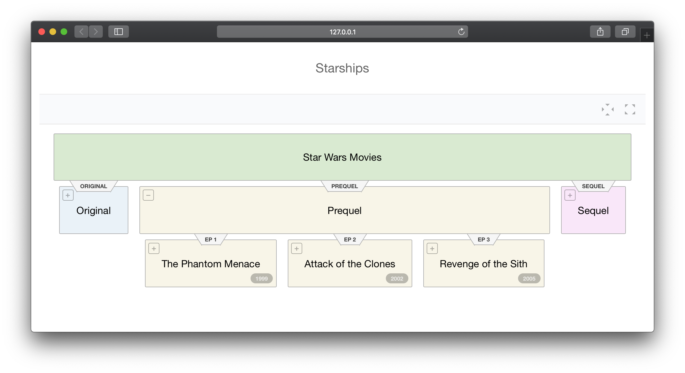

<!-- README.md is generated from README.Rmd. Please edit that file -->

```{r, include = FALSE}
knitr::opts_chunk$set(
  collapse = TRUE,
  comment = "#>",
  fig.path = "man/figures/README-",
  out.width = "100%"
)
```

# hierplane

<!-- badges: start -->
[](https://github.com/tyluRp/hierplane/actions)
[](https://codecov.io/gh/tyluRp/hierplane?branch=master)
<!-- badges: end -->

:warning: Work in progress :warning:

The goal of `hierplane` is to visualize trees. This is an HTML widget that uses source code from the [original javascript library](https://github.com/allenai/hierplane). A handful of functions are provided that allow R users to render hierplanes in shiny. See a live demonstration [here](https://tylerlittlefield.com/shiny/tyler/hierplane/).

## Installation

You can install the development version from [GitHub](https://github.com/) with:

``` r
# install.packages("devtools")
devtools::install_github("tyluRp/hierplane")
```

## Example

Rendering a hierplane requires you to:

1. Create a hierplane object with `hp_` functions
2. Render the hierplane with `hierplane()`

A hierplane object can be created from different input data, below are some examples:

```{r creating-hierplain-objects, message=FALSE}
library(hierplane)

# from a string, requires spacyr package
hp_spacyr("Sam likes boats")

# from a dataframe
hp_dataframe(starships)

# from YAML, requires data.tree and yaml package
yaml <- "
name: r4fun
tyler:
  name: Tyler
  job: Data Scientist
  species: Human
"

x <- data.tree::as.Node(yaml::yaml.load(yaml))
hp_datatree(x)
```

With this, we can render a hierplane in shiny:

```r
library(hierplane)
library(shiny)

ui <- fluidPage(
  hierplaneOutput("hplane")
)

server <- function(input, output, session) {
  output$hplane <- renderHierplane({
    x <- hp_spacyr("Sam likes boats")
    hierplane(x)
  })
}

shinyApp(ui, server)
```

```{r render-screenshot, echo=FALSE, dpi=300}

```

If you are familiar with `data.tree`, you can use it to visualize trees as well. Here is an example of generating a hierplane from YAML:

```r
library(data.tree)
library(yaml)

"
name: r4fun
tyler:
  name: Tyler
  job: Data Scientist
  species: Human
  toulouse:
    name: Toulouse
    job: Systems Engineer
    species: Cat
    jojo:
      name: Jojo
      job: Python Programmer
      species: Dog
  ollie:
    name: Ollie
    job: Database Administrator
    species: Dog
  lucas:
    name: Lucas
    job: R Programmer
    species: Rabbit
" -> yaml

yaml %>% 
  yaml.load() %>% 
  as.Node() %>% 
  hp_datatree(
    title = "r4fun github group",
    link = "species",
    attributes = "job"
  ) %>% 
  hierplane(
    theme = "light", 
    width = "auto",
    height = "auto"
  )
```

```{r, echo=FALSE, dpi=300}

```

While hierarchical data isn't common in a `data.frame` centric language like R, we are working on a way to parse a `data.frame` to hierplane ready data. This works by using `hp_dataframe()`:

```r
ui <- fluidPage(
  hierplaneOutput("hplane")
)

server <- function(input, output, session) {
  output$hplane <- renderHierplane({
    hierplane(hp_dataframe(starships, title = "Starships"))
  })
}

shinyApp(ui, server)
```

```{r render-screenshot2, echo=FALSE, dpi=300}

```

## Acknowledgements

* [`allenai/hierplane`](https://github.com/allenai/hierplane): The original javascript library that this package uses
* [`DeNeutoy/spacy-vis`](https://github.com/DeNeutoy/spacy-vis): Spacy models using hierplane 
